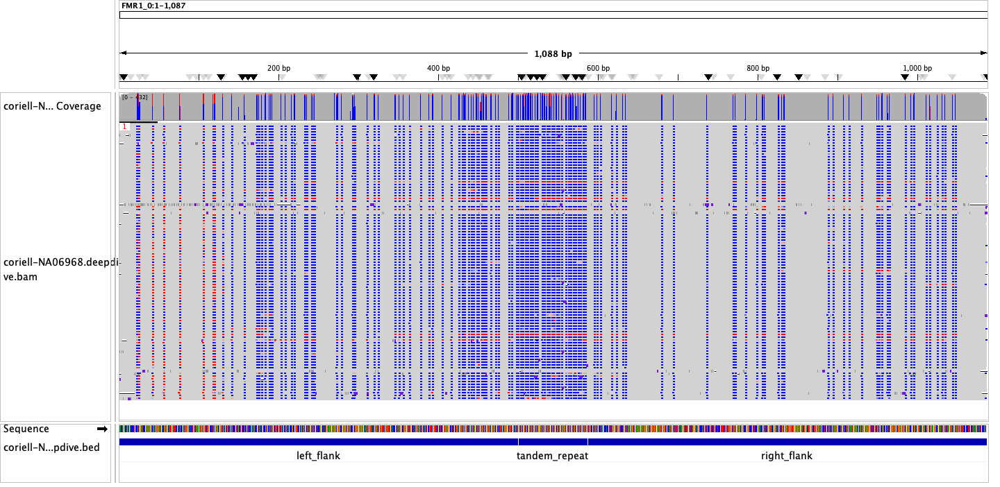
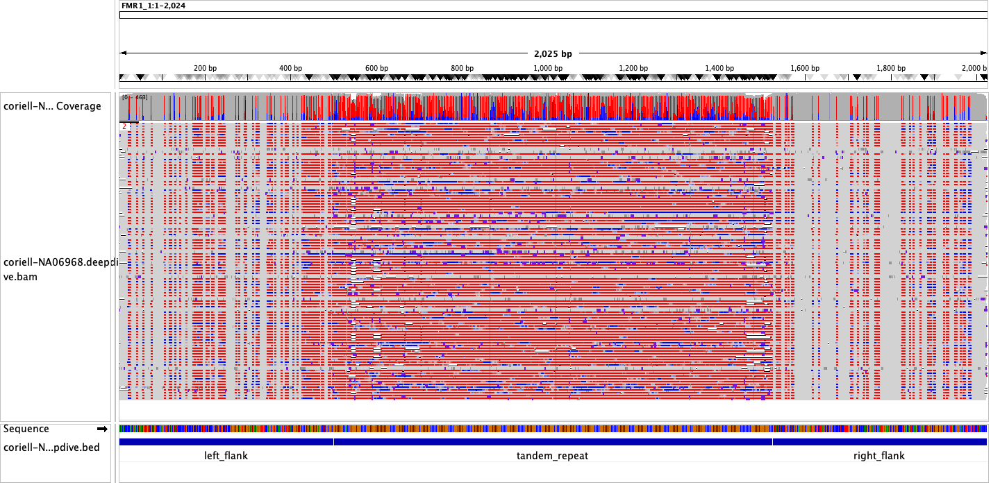

# Using TRGT deepdive outputs

The `trgt deepdive` command is meant to facilitate locus-specific downstream
analysis after genotyping. The first step of such analyses often involves
re-aligning reads associated to each allele to their consensus sequences. For
this purpose, the command takes the outputs of `trgt genotype`, as well as the
reference and BED annotation, and realigns each read to its matching consensus
sequence.

The interface for the command looks like this:
```
$ trgt deepdive [OPTIONS] --genome <FASTA> --vcf <VCF> --repeats <REPEATS> --spanning-reads <SPANNING_READS> --repeat-id <REPEAT_ID> --output-prefix <OUTPUT_PREFIX>
```

Here `--genome` and `--repeats` are the same as in `trgt genotype` and `trgt plot`, 
and `--spanning-reads` and `--vcf` are the outputs of `trgt genotype`.
Finally, specify which repeat should be realigned through the `--repeat-id`
flag. The name must match the name the repeat `ID`  in the fourth column of the
repeats BED file.

There are three outputs to the command:
 1. A FASTA file containing the consensus and flanking sequence of all genotyped
    alleles,
 2. A BAM file that re-aligns the genotyped reads to their matching consensus,
    including both flanks and tandem repeats and
 3. A BED file highlighting where the flanks and tandem repeat start and end.

The suffixes `.fasta`, `.bam` and `.bed` will be added to the value passed on 
`--output-prefix`. The BAM output is already sorted and indexed.

**NOTE**: The flank length is automatically calculated as the largest flank
value in the `.spanning.bam` input (stored in the `FL` tag of each read, which you can
inspect using `samtools view`). To increase the flank length, rerun `trgt genotype`
by setting both the values of `--flank-len` and `--output-flank-len`
to the desired values you wish to analyze. If these values are not overridden in
the genotype command, the default value is set to 50.

### Example: Allele-specific FMR1 methylation in the NA06968 cell line

This example concerns a repeat region in the *FMR1* gene. This is a CGG tandem
repeat in the X chromosome whose expansion is associated with Fragile-X
syndrome. The sample below is a
[PureTarget](https://www.pacb.com/technology/puretarget) dataset, which was
genotyped using `trgt genotype` with a flank length of 500 and the `--preset targeted` flag set.

The outputs of `trgt deepdive` were designed to be viewed on
[IGV](https://igv.org/), but should be proper inputs for various other
downstream tools. You can load the FASTA outputs through `Genomes > Load Genome from File`, 
and add the mapped reads and annotation using `File > Load from File`.

The output BAM contains methylation information that can be visualized by IGV.
This allows individual CpGs to be queried. We recommend passing the outputs of
this command to
[pb-CpG-tools](https://github.com/PacificBiosciences/pb-CpG-tools) to genereate
pileup-level CpG methylation values.


In this example, the short allele is unmethylated in both flanks and tandem
repeat:



Whereas the long allele is predominantly methylated, which is expected in FMR1
expansions with 200+ CGG motif units:


