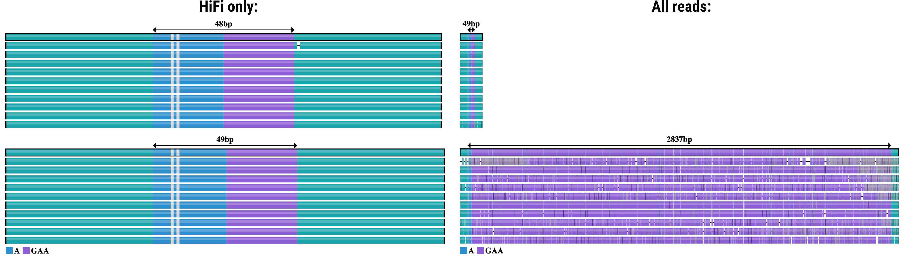

# TRGT analysis of PureTarget data

The [PureTarget repeat expansion
panel](https://www.pacb.com/technology/puretarget) is a targeted assay used to
simultaneously resolve multiple pathogenic tandem repeats. The assay produces
multiplexed high-depth sequencing libraries for dozens of samples in a single run.

To use TRGT with PureTarget data, we need to

 1. Use all reads produced by a sequencing run
 2. Use `--preset targeted` when running TRGT

Below we will describe the commands used to attain these adjustments.

## 1. Create a BAM file with all sequenced reads

This step will depend on which sequencer was used.

### Preparing data generated on the Revio system

If reads were sequenced on a Revio, you should have two BAM files:
`hifi_reads/movie.hifi_reads.bam` and `fail_reads/movie.fail_reads.bam` (where
`movie` is a run-specific movie name). The BAM filename may also contain the
demultiplexed barcode name, but the important part is that the two files only
differ by the words "hifi" and "fail".

To prepare the input for analysis, use
[pbmerge](https://github.com/PacificBiosciences/pbbam) to merge both BAM files
as follows:

```
pbmerge -o movie.input.bam hifi_reads/movie.hifi_reads.bam fail_reads/movie.fail_reads.bam
```

(note: `pbmerge` is recommended over `samtools merge` to create proper inputs
for downstream tools such as `lima` or `pbmm2`).

### Preparing sequencing data generated on the Sequel II or Sequel IIe system

If your sample is generated on a Sequel II/IIe system, you should have access to
the `.subreads.bam` file. In that case, when running `ccs`, use the
[mode-all](https://ccs.how/faq/mode-all.html) as follows:

```
ccs --all movie.subreads.bam movie.input.bam
```

In either case, the resulting `movie.input.bam` is the starting point of the
analysis. It should be mapped using
[pbmm2](https://github.com/pacificBiosciences/pbmm2) using the default `--preset
HIFI`, similar to WGS reads:

```
pbmm2 align --preset HIFI movie.input.bam movie.pbmm2.bam
```

## 2. Use `--preset targeted` when running TRGT

We strongly recommend PureTarget samples to be analyzed with the `--preset
targeted` option when running TRGT. All other parameters can be set as the
defaults.

The resulting command would look like this:

```
./trgt genotype \
       --preset targeted \
       --genome example/reference.fasta \
       --repeats example/repeat.bed \
       --reads example/sample.bam \
       --output-prefix sample
```

# Troubleshooting/FAQ

### 1. Why does my input BAM file have to contain all reads instead of HiFi only?

The PureTarget protocol produces insert sizes of about 5 kb.  Large expansions
of loci like *FXN*, *C9orf72*, *DMPK* and *CNBP* produce much larger molecules
that may not produce reads reaching HiFi quality thresholds at typical movie
times (recall that HiFi reads have an [average quality of Q20 or
more](https://ccs.how/nomenclature.html)). Using all reads produced by the
sequencer may significantly increase the coverage of expanded alleles and
prevent [allelic
dropouts](https://www.sciencedirect.com/topics/agricultural-and-biological-sciences/allelic-dropouts).

Below is a comparison using an extreme example of a *FXN* carrier sequenced on a
Revio platform.  On the left is the [trgt
plot](https://github.com/PacificBiosciences/trgt/blob/main/docs/trvz-plots.md)
when only HiFi reads are used, and on the right is the same dataset when all
available reads are used for the analysis:



### 2. What does --preset targeted do?

The `--preset targeted` command-line option make the following changes on TRGT:

1. It disables filtration of reads based on the `rq` tag. By default TRGT only
   uses reads with `rq >= 0.98`
2. It sets the `--genotyper cluster` flag, which assigns reads to alleles based
   on the sequence composition, and not just the individual STR size of each
   read
3. It uses an alignment scoring for flanking sequences that is optimized for
   all types of reads (e.g., penalizing opening gaps less severely).

### 3. My output does not have an expected repeat expansion

This may occur if only hifi reads are being used as the input. Please ensure
your input BAM file contains all sequenced reads, as described in step 1 of this
document. This may also occur if `--preset targeted` was not set when running
TRGT, in which case the expanded reads may be filtered out and TRGT will produce
a warning like this:

```
[WARN] - FXN: Quality filtered 35/106 reads
```

### 4. I see a clear motif in the allele consensus sequence that is not reported by TRGT or depicted on TRGT plots. Why?

TRGT only analyzes the motif units defined in the repeats catalog, so novel
motifs will not be quantified. Algorithms for *de novo* discovery of motif units
are currently under development. Until then, our suggested solution is to re-run
TRGT by adding the novel motif to the repeat catalog. For example, if you have
set `MOTIFS=CAG`, and you clearly see the motif `CCG` in your consensus, change
the BED file to `MOTIFS=CAG,CCG` and re-run TRGT. The resulting genotype should
be identical, but the VCF tags will contain quantification of spans of the new
`CCG` motif.

### 5. The targeted preset shows a warning about purity filtering reads

Using the `targeted` preset, you may see a warning like this:

```
[WARN] - FXN: Filtered out 5 impure reads
```

Internally, TRGT uses a heuristic that discards any lower-quality read that does
not resemble a relatively perfect tandem repeat (less than 70% similarly in
terms of the edit distance).  This heuristic cannot be disabled, and the number
of reads discarded is reported as a warning.

