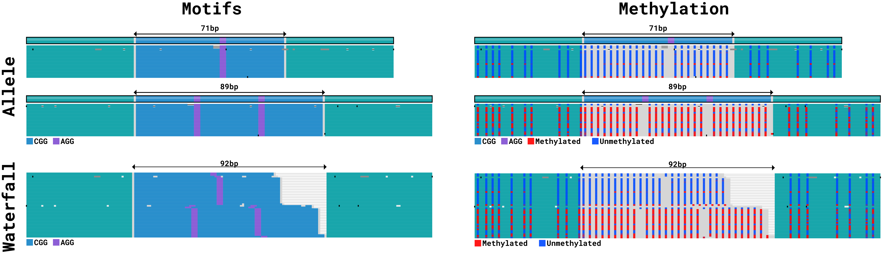

# Interpreting TRGT plots

This guide explains how to interpret the pileup-style visualizations produced by
TRGT. The examples below walk through the most common options so you can quickly
decide which plot best conveys the structure of a tandem repeat and the evidence
supporting it.

## Summary

- `--plot-type allele` (default) renders one panel per allele, showing the
  consensus allele sequence and how each HiFi read aligns to it, including
  mismatches, insertions, and deletions.
- `--plot-type waterfall` skips alignment and instead renders the repeat-spanning
  portion of each read end-to-end, which makes mosaic or heterogeneous repeats
  easier to identify.
- `--show motifs` (default) colors each motif class so repeated sequences stand
  out against the surrounding flanks, while `--show meth` annotates CpG sites
  with 5mCpG methylation levels.
- `--squished` compacts spacing for high coverage targeted data, and
  `--max-allele-reads` limits how many reads appear in each panel when coverage
  would otherwise overwhelm the plot.

## An HTT repeat in the HG002 sample

The *HTT* gene contains adjacent CAG and CCG tandem repeats. Expansion of the
CAG repeat causes Huntington's disease.

The allele plot below shows one panel per allele. The top track in each panel is
the consensus sequence inferred for that allele. The CAG and CCG repeats are
shown in blue and purple respectively. The unsegmented regions (regions not
matching either CAG or CCG motifs) are shown in light gray. Deletions and
insertions in the allele sequence relative to the perfect, uninterrupted repeat
are also shown when they are present. The remaining tracks show how individual
HiFi reads align to the consensus allele sequence. Gray bars mark mismatches, vertical lines
mark insertions, and horizontal lines mark deletions.

|  |
| :---: |
| Allele view of the *HTT* locus in HG002, colored by motif with per-read alignments. |

The waterfall plot uses the same reads but does not perform an alignment step.
Instead, each read contributes a single row that displays the repeat-spanning
segment in read order. The perfect copies of the CAG and CCG motifs are depicted
in blue and purple respectively. The remaining portions of the read sequences
are colored in light gray. Because reads are not warped to a consensus, you can
instantly spot minor sequence variants and complex mixtures that might be hidden
in an alignment view.

|  |
| :---: |
| Waterfall view of the same HiFi reads, showing the repeat-spanning segment without alignment. |

## Comparing plot styles on FMR1

TRGT can render both motif-centric and methylation-aware views for each plot
type. The motif view highlights how repeat units are organized; the methylation
view overlays CpG methylation calls so epigenetic differences between alleles
are visible at a glance. Toggling between these modes is controlled by
`--show motifs` (the default) and `--show meth`.

The figure below shows all four combinations for the *FMR1* locus in HG00281:
allele versus waterfall plots, each rendered with motif coloring and with
methylation shading. Together they demonstrate how the different renderings
complement one another. The motif views make it easy to count repeat units and
spot interruptions, while the methylation views reveal that the long expanded
allele is heavily methylated and the shorter allele has little to no methylation
signal.

|  |
| :---: |
| Different styles of TRGT plots for *FMR1* in HG00281. The options `--squished` and `--max-allele-reads 20` were used to conserve space, compressing the plots and limiting each allele to 20 reads. |
