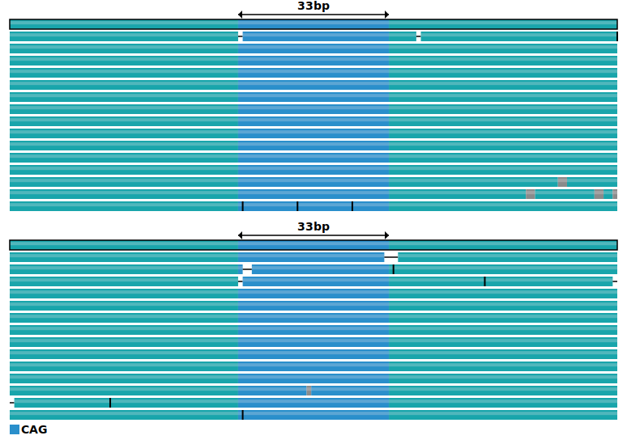

# Introductory tutorial

In this tutorial, you will learn the basics of TRGT by analyzing a tiny example
dataset included in this repository.

## Prerequisites

- Download the [latest TRGT release](https://github.com/PacificBiosciences/trgt/releases)
- Download the [example dataset](https://github.com/PacificBiosciences/trgt/tree/main/example)
- Install recent versions of `samtools` and `bcftools`

> Tip: Place the TRGT binary on your `PATH`, or run it with a relative path as
> shown in the commands below.

## Overview of the input files

The example directory provides three required files:

- `reference.fasta` – the reference assembly that TRGT uses for context
- `sample.bam` – HiFi reads aligned to that reference
- `repeat.bed` – tandem repeat definition catalog for genotyping

Each row in `repeat.bed` follows a BED-style layout with annotation tags in the
fourth column. For this example, the single entry looks like:

```bash
$ cat example/repeat.bed
chrA    10000    10061    ID=TR1;MOTIFS=CAG;STRUC=<TR>
```

`ID` names the locus (`TR1`), `MOTIFS` lists the repeat unit(s) and the `STRUC`
field can be always set to value `<TR>`.

## Genotyping repeats

To genotype the repeat, run:

```bash
./trgt genotype --genome example/reference.fasta \
       --repeats example/repeat.bed \
       --reads example/sample.bam \
       --output-prefix sample
```

Two primary outputs are created:

- `sample.vcf.gz` – genotypes and per-allele statistics
- `sample.spanning.bam` – read segments that fully span each repeat

For example, use `bcftools` to examine the first (and only) record of the VCF
file:

```bash
$ bcftools view --no-header sample.vcf.gz | head -n 1
#CHROM  POS  ID  REF  ALT  QUAL  FILTER  INFO  FORMAT  sample
chrA	10001	.	CCAGCAGCAGCAGCAGCAGCAGCAGCAGCAGCAGCAGCAGCAGCAGCAGCAGCAGCAGCAG	CCAGCAGCAGCAGCAGCAGCAGCAGCAGCAGCAG	.	.	TRID=TR1;END=10061;MOTIFS=CAG;STRUC=<TR>	GT:AL:ALLR:SD:MC:MS:AP:AM	1/1:33,33:30-39,33-33:15,14:11,11:0(0-33),0(0-33):1,1:.,.
```

Note that TRGT prepends a single padding base to each repeat allele sequenece
(the first base of the string). Ignoring that base, the record tells us that:

- The tandem repeat starts at position 10001 on contig `chrA`
- The reference allele sequence of this repeat is
  CAGCAGCAGCAGCAGCAGCAGCAGCAGCAGCAGCAGCAGCAGCAGCAGCAGCAGCAGCAG and contains 20
  copies of the `CAG` motif
- Both observed alleles have 11 copies of `CAG`, resulting in a homozygous
  non-reference call

See [vcf_files.md](./vcf_files.md) for a detailed breakdown of the generated VCF files
and interpretation tips, and refer to [bam_files.md](./bam_files.md) for guidance on
interpreting the spanning BAM output and its per-read annotations.

## Sort and index the outputs

TRGT leaves both files unsorted. Sorting and indexing makes them compatible with
tools that expect coordinate order.

Sort and index the VCF:

```bash
bcftools sort -Oz -o sample.sorted.vcf.gz sample.vcf.gz
bcftools index sample.sorted.vcf.gz
```

Then sort and index the BAM:

```bash
samtools sort -o sample.spanning.sorted.bam sample.spanning.bam
samtools index sample.spanning.sorted.bam
```

At this point the outputs are ready for downstream filtering, visualization, or
integration with other variant calls.

## Visualizing a repeat

To visualize the repeat with the identifier "TR1", run:

```bash
./trgt plot --genome example/reference.fasta \
       --repeats example/repeat.bed \
       --vcf sample.sorted.vcf.gz \
       --spanning-reads sample.spanning.sorted.bam \
       --repeat-id TR1 \
       --image TR1.svg
```

The resulting `TR1.svg` can be opened directly in any modern browser or edited
in vector tools such as [Inkscape](https://inkscape.org/). The plot highlights
the motif sequence of each allele (blue) and the flanking sequence (green), and
stacks supporting reads underneath. For more details on interpreting plots,
continue with the [TRVZ plot walkthrough](./trvz-plots.md).

|  |
| :---: |
| TRGT pileup for `TR1`, showing the homozygous 11× CAG repeat with flanking context. |

## Deepdive on a repeat

When you need more in depth analysis on one locus, run the
`trgt deepdive` command:

```bash
./trgt deepdive --genome example/reference.fasta \
       --repeats example/repeat.bed \
       --vcf sample.sorted.vcf.gz \
       --spanning-reads sample.spanning.sorted.bam \
       --repeat-id TR1 \
       --output-prefix sample.TR1
```

TRGT writes three files: a FASTA with allele consensus plus flanks, a BAM that
realigns the spanning reads to those consensus sequences, and a BED that marks
repeat and flank boundaries. The BAM is already sorted and indexed, so it can be
loaded directly into IGV or downstream tooling. If you need longer
flanks than the defaults, rerun `trgt genotype` with higher values for
`--flank-len` and `--output-flank-len`.

See the [deepdive guide](./deepdive.md) for advanced usage and a
walkthrough using *FMR1*.
